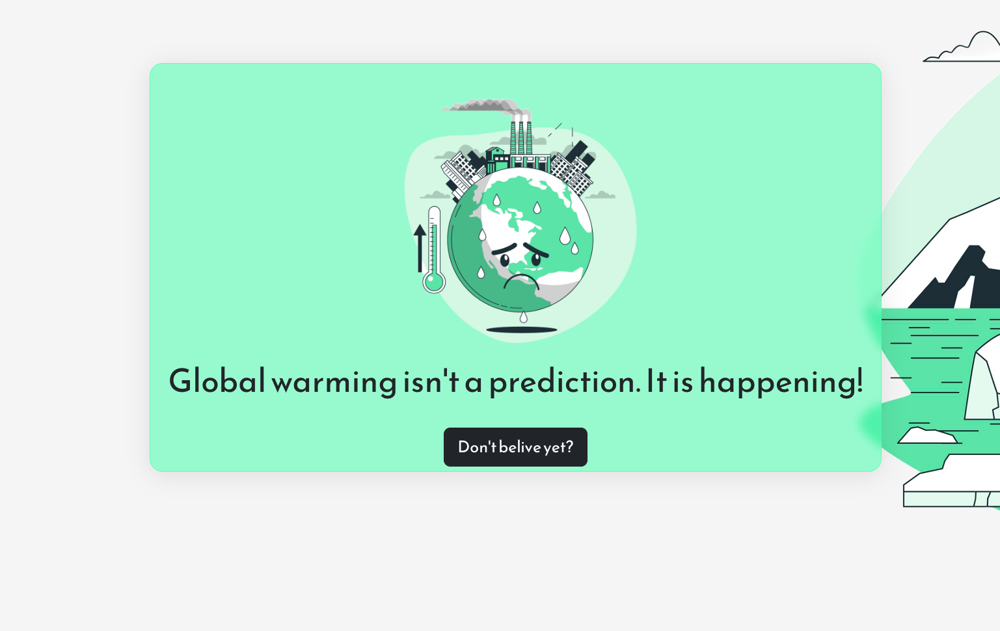

# WARMING WARNING-WEBSITE

Educational website about global warming. Line charts with data of methane,temperature,n2o,artic area,co2 in our planes

## Link :

[warming-warning-website](https://teal-puffpuff-2eed12.netlify.app/)

## Documentation API

[APIs](https://global-warming.org)

## React Libraries

plx-react: for parallax effects

react-apexcharts: for line charts

## Languages and tools:

REACT, JS, SASS, BOOTSTRAP 
